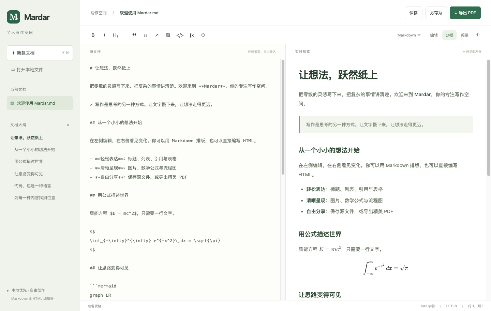

# Mardar

Electron + Vite 实现的本地 Markdown 编辑器，面向 macOS、Windows、Linux。



## 开始使用

需要 Node.js 22.12+ 和 npm。

```sh
npm ci
npm start
```

`npm run dev` 启动前端开发预览；浏览器模式使用下载保存和浏览器打印。完整本地文件访问与原生 PDF 导出请使用 `npm start`。

## 功能

- 新建、打开、保存及另存 Markdown 源文件，关闭或切换文档时提醒未保存更改。
- 即时编辑：点击段落编辑 Markdown，离开段落恢复效果；代码块、表格等按完整块编辑，保存保留原始源码。格式工具栏切换到源码分栏编辑。
- 最近打开的 12 个本地文件（重启保留）；Windows 安装后可从 `.md` / `.markdown` 文件的“打开方式”选择 Mardar，支持冷启动和已运行实例，仅在存在未保存更改时提示保存。
- About 显示 Git tag 版本、UTC 编译日期和完整提交哈希。构建要求 Git 标签，发布工作流使用对应标签。
- 双栏实时预览、独立编辑/阅读模式、大纲导航、深色主题、字符统计。
- Markdown 标题、列表、引用、表格、HTML 片段、代码高亮。
- KaTeX 数学公式：`$E=mc^2$` 或独立行 `$$` 包裹块级公式。
- Mermaid 图表：使用语言名为 `mermaid` 的代码块。
- 图片工具栏插入、拖入和粘贴；插入的图片使用内嵌数据，随源文件保存。打开的文档支持相对路径图片及 HTTPS 图片。
- 原生 A4 PDF 导出，包含公式、图表、代码和已加载的图片，隐藏编辑工具栏。
- 每次启动默认打开空白新文档；通过系统“打开方式”启动时直接打开指定文件。
- `Ctrl/Cmd+S` 保存、`Ctrl/Cmd+Shift+S` 另存、`Ctrl/Cmd+O` 打开、`Ctrl/Cmd+N` 新建、`Ctrl/Cmd+B/I` 粗体/斜体。

支持 Markdown 内嵌 HTML（例如 ``），图片允许安全的缩放和尺寸样式，脚本及页面定位样式会被过滤。外部链接不会在编辑器内导航。数学、图表及高亮资源随应用打包，可离线使用；网络图片需要联网。

## 检查与打包

```sh
npm run build
npm test
npm run pack
npm run dist
```

`npm test` 运行真实 Electron 集成测试，验证公式、图表、代码、Markdown 读写、内嵌 HTML、图片、未保存更改保护与 PDF 输出。Linux 无桌面环境时使用 `xvfb-run --auto-servernum npm test`。

完成打包后，使用 `node scripts/test-packaged.mjs` 对当前系统的应用包运行同一组测试。CI 也直接测试打包产物。

当前构建与实测范围见 [验证记录](docs/verification.md)。

可在 macOS Docker 上复现 Linux 包内应用测试（需要已生成 `release/linux-unpacked/`）：

```sh
docker build --platform linux/amd64 -t mardar-linux-test - < tests/Dockerfile.linux
docker run --rm --platform linux/amd64 --network none --init --shm-size=1g --volume "$PWD:/workspace" mardar-linux-test
```


在对应操作系统运行 `npm run dist` 可生成 `release/` 下的 macOS DMG/ZIP、Windows NSIS、Linux AppImage。发行签名和 macOS 公证需由发布者配置证书；默认构建供本地试用。

## CI 与发布

- `.github/workflows/ci.yml`：推送到 `main` 及 PR 时，在 macOS、Windows、Linux 上构建安装包并对打包产物运行集成测试。
- `.github/workflows/release.yml`：推送 `v*` 标签时，按标签设置版本号，构建 macOS（x64/arm64 DMG、ZIP）、Windows x64 安装程序、Linux x64 AppImage，附带 `SHA256SUMS.txt` 发布到 GitHub Release。

```sh
git tag v1.0.0
git push origin v1.0.0
```

安装包未签名。macOS 下载后如提示“已损坏”，执行 `xattr -cr /Applications/Mardar.app`；Windows SmartScreen 选择“仍要运行”。

## 结构

- `electron/main.cjs`：窗口、受控 IPC、本地文件、PDF。
- `electron/preload.cjs`：隔离桥接接口。
- `src/main.js`：界面、编辑和操作流程。
- `src/render.js`：Markdown、HTML 清理、公式、代码和图表。
- `tests/editor.spec.js`：真实桌面集成测试。

Electron 使用隔离上下文、沙箱和关闭 Node 集成的渲染进程。主进程验证 IPC 来源；文件路径来自原生对话框、最近文件列表或系统打开请求。参考 [Electron 安全文档](https://www.electronjs.org/docs/latest/tutorial/security)。
