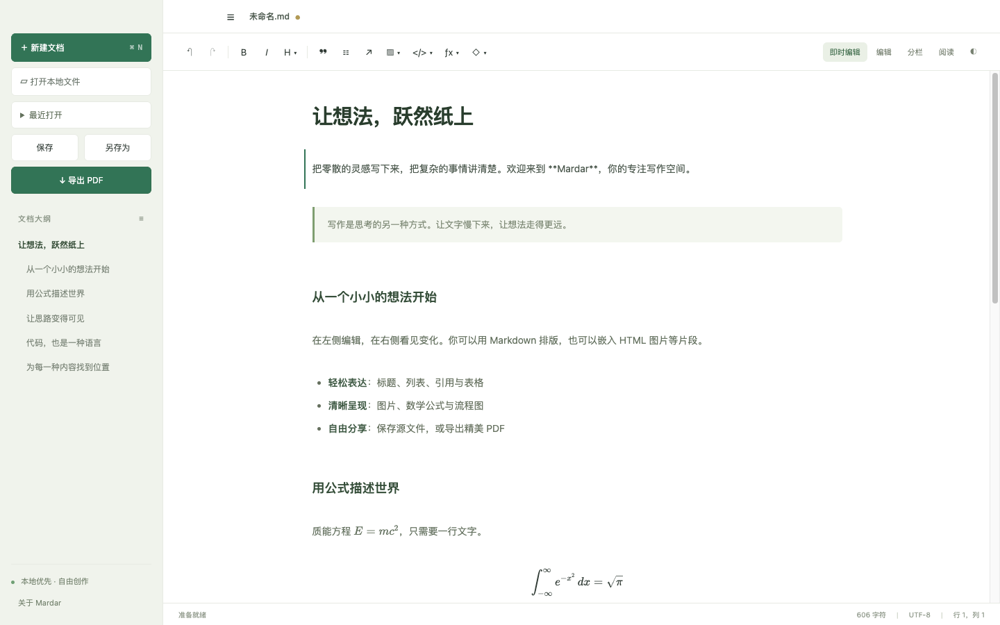
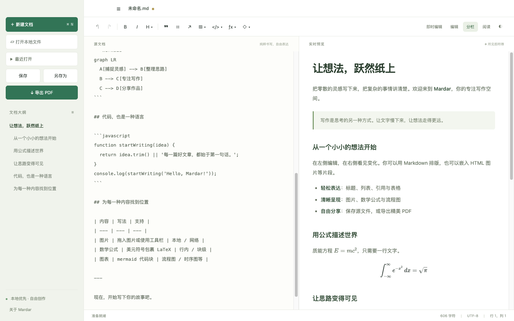
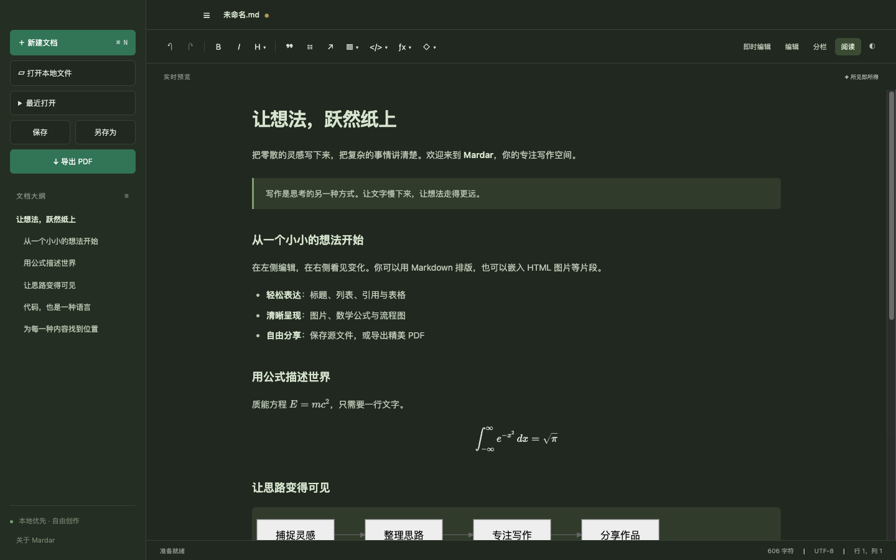
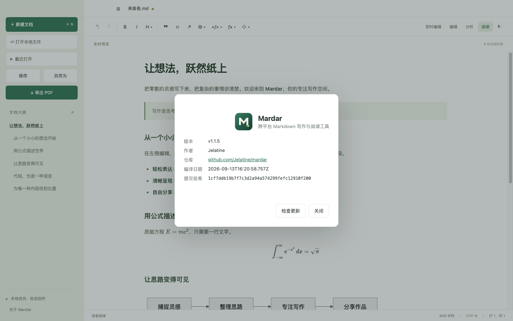

# Mardar

跨平台 Markdown 写作与阅读工具，基于 Electron + Vite，支持 macOS、Windows、Linux。

[官网](https://jelatine.github.io/mardar/) · [下载](https://github.com/Jelatine/mardar/releases/latest) · [问题反馈](https://github.com/Jelatine/mardar/issues)



| 分栏预览 | 深色阅读 | 关于与更新 |
| --- | --- | --- |
|  |  |  |

## 下载安装

从 [GitHub Releases](https://github.com/Jelatine/mardar/releases/latest) 下载对应系统的安装包：

| 系统 | 文件 |
| --- | --- |
| macOS（Apple 芯片 / Intel） | `Mardar-<版本>-mac-arm64.dmg` / `Mardar-<版本>-mac-x64.dmg` |
| Windows x64 | `Mardar-<版本>-win-x64.exe` |
| Linux x64 | `Mardar-<版本>-linux-x86_64.AppImage` |

安装包未签名。macOS 下载后如提示“已损坏”，执行 `xattr -cr /Applications/Mardar.app`；Windows SmartScreen 选择“仍要运行”。所有文件的校验值见发布页的 `SHA256SUMS.txt`。

## 功能

- **即时编辑**（默认）：类似 Typora / Obsidian 的书写方式。新建或打开空文档后光标直接就位，未聚焦时点击页面空白处即可开始写作，正在编辑时点击空白处取消聚焦并渲染；点击段落时光标定位到对应的 Markdown 源码位置，离开段落自动渲染。方向键在段落间移动，段首退格与上一段合并，`Esc` 结束编辑。代码块、表格、公式等按完整块编辑，保存保留原始源码。
- 编辑、分栏、阅读三种视图；分栏模式下源码与预览的滚动和光标位置双向同步。
- 新建、打开、保存及另存 Markdown 源文件，关闭或切换文档时提供保存、不保存与取消选项，取消保存或保存失败会保留窗口；每次启动默认打开空白新文档。
- 最近打开的 12 个本地文件（重启保留）；可从系统“打开方式”选择 Mardar 打开 `.md` / `.markdown` 文件，支持冷启动和已运行实例。
- Markdown 标题、列表、引用、表格、HTML 片段与代码高亮，工具栏提供标题、代码语言、公式和图表模板，以及可设置行列数的表格插入。
- KaTeX 数学公式：`$E=mc^2$` 或独立行 `$$` 包裹块级公式。
- Mermaid 图表：使用语言名为 `mermaid` 的代码块。
- 图片工具栏提供 Markdown、HTML ``、网络 URL 和 Base64 四种入口；前两种可手动输入路径或选择本地图片，已保存文档优先使用相对路径，向上超过两级、跨盘或文档未保存时使用绝对路径。支持本地路径及 HTTPS 图片；拖入和粘贴的图片使用内嵌数据，随源文件保存。
- 原生 A4 PDF 导出，包含公式、图表、代码和已加载的图片；Mermaid 使用蓝白节点、清晰连线与浅蓝背景，保持矢量输出。
- 深色主题、大纲导航、字符统计。
- **关于**：显示版本（Git tag）、作者、仓库地址、UTC 编译日期和完整提交哈希。
- **检查更新**：启动后自动检查 GitHub 最新发布，发现新版本时在状态栏提示；也可在“关于 Mardar”或 macOS 菜单“检查更新…”中手动检查。
- `Ctrl/Cmd+F` 打开文本搜索，支持全词匹配、大小写匹配和正则表达式；`Enter` / `Shift+Enter` 切换下一个 / 上一个结果，`Esc` 关闭。编辑和分栏视图搜索 Markdown 源码，阅读和即时编辑视图搜索渲染后的文本。最多显示 10,000 个结果，耗时过长的正则会自动停止。
- `Ctrl/Cmd+S` 保存、`Ctrl/Cmd+Shift+S` 另存、`Ctrl/Cmd+O` 打开、`Ctrl/Cmd+N` 新建、`Ctrl/Cmd+B/I` 粗体/斜体、`Ctrl/Cmd+Z` / `Ctrl/Cmd+Shift+Z` 撤销/重做。

支持 Markdown 内嵌 HTML（例如 ``），图片允许安全的缩放和尺寸样式，脚本及页面定位样式会被过滤。外部链接不会在编辑器内导航。数学、图表及高亮资源随应用打包，可离线使用；网络图片需要联网。

## 自动更新

更新数据来自 GitHub Releases 的最新正式版本。点击“下载并安装”后，Mardar 下载当前系统和架构对应的安装包，按发布附带的 `SHA256SUMS.txt` 校验，确认未保存的文档后安装：

| 平台 | 安装方式 |
| --- | --- |
| macOS | 下载 ZIP，退出后替换当前 `Mardar.app` 并重新启动（需要应用所在目录可写；从 DMG 直接运行时请先拖入“应用程序”） |
| Windows | 下载并启动 NSIS 安装程序完成覆盖安装（需通过安装程序安装的 Mardar） |
| Linux | 原地替换正在使用的 AppImage 并重新启动 |

不支持原地更新的运行方式（开发模式、解压版等）会改为打开发布页手动下载。

## 开发

需要 Node.js 22.12+ 和 npm。构建需要 Git 标签（用于生成版本号）。

```sh
npm ci
npm start
```

`npm run dev` 启动前端开发预览；浏览器模式使用下载保存和浏览器打印。完整本地文件访问、原生 PDF 导出和更新请使用 `npm start`。

## 检查与打包

```sh
npm run build
npm test
npm run pack
npm run dist
```

`npm test` 运行真实 Electron 集成测试，验证即时编辑、公式、图表、代码、Markdown 读写、内嵌 HTML、图片、未保存更改保护、检查更新与 PDF 输出。更新检查在测试中使用本地模拟发布源（`MARDAR_UPDATE_FEED`），不访问网络。Linux 无桌面环境时使用 `xvfb-run --auto-servernum npm test`。

完成打包后，使用 `node scripts/test-packaged.mjs` 对当前系统的应用包运行同一组测试。CI 也直接测试打包产物。当前构建与实测范围见 [验证记录](docs/verification.md)。

更新 README 与官网截图：

```sh
npm run build
node scripts/screenshots.mjs
```

可在 macOS Docker 上复现 Linux 包内应用测试（需要已生成 `release/linux-unpacked/`）：

```sh
docker build --platform linux/amd64 -t mardar-linux-test - < tests/Dockerfile.linux
docker run --rm --platform linux/amd64 --network none --init --shm-size=1g --volume "$PWD:/workspace" mardar-linux-test
```

在对应操作系统运行 `npm run dist` 可生成 `release/` 下的 macOS DMG/ZIP、Windows NSIS、Linux AppImage。发行签名和 macOS 公证需由发布者配置证书；默认构建供本地试用。

## CI 与发布

- `.github/workflows/ci.yml`：推送到 `main` 及 PR 时，在 macOS、Windows、Linux 上构建安装包并对打包产物运行集成测试。
- `.github/workflows/release.yml`：推送 `v*` 标签时，按标签设置版本号，构建 macOS（x64/arm64 DMG、ZIP）、Windows x64 安装程序、Linux x64 AppImage，附带 `SHA256SUMS.txt` 发布到 GitHub Release。应用内更新依赖这些文件名和校验文件。
- 官网：`docs/index.html` 通过 GitHub Pages（`main` 分支 `/docs` 目录）发布到 <https://jelatine.github.io/mardar/>，下载按钮从最新发布自动获取。

```sh
git tag v1.0.0
git push origin v1.0.0
```

## 结构

- `electron/main.cjs`：窗口、受控 IPC、本地文件、PDF。
- `electron/updater.cjs`：检查、下载、校验并安装更新。
- `electron/preload.cjs`：隔离桥接接口。
- `src/main.js`：界面、即时编辑和操作流程。
- `src/render.js`：Markdown、HTML 清理、公式、代码和图表。
- `tests/editor.spec.js`：真实桌面集成测试。
- `docs/index.html`：项目官网。

Electron 使用隔离上下文、沙箱和关闭 Node 集成的渲染进程。主进程验证 IPC 来源；文件路径来自原生对话框、最近文件列表或系统打开请求；外部链接仅允许打开本项目仓库与官网。参考 [Electron 安全文档](https://www.electronjs.org/docs/latest/tutorial/security)。

## 作者与许可

作者：[Jelatine](https://github.com/Jelatine) · 仓库：<https://github.com/Jelatine/mardar>

基于 MIT 协议发布。
